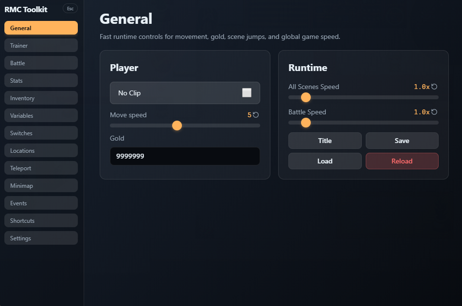
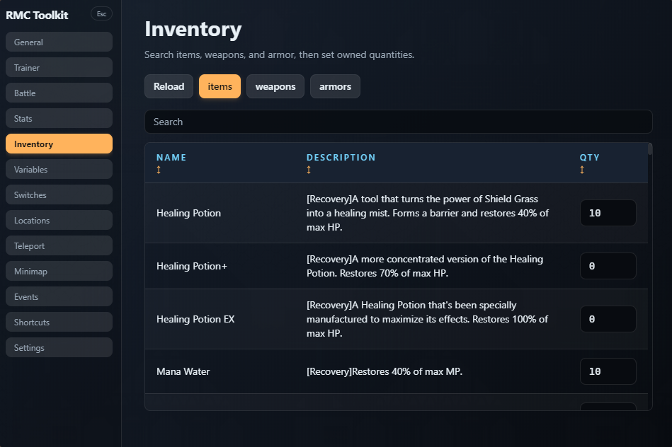
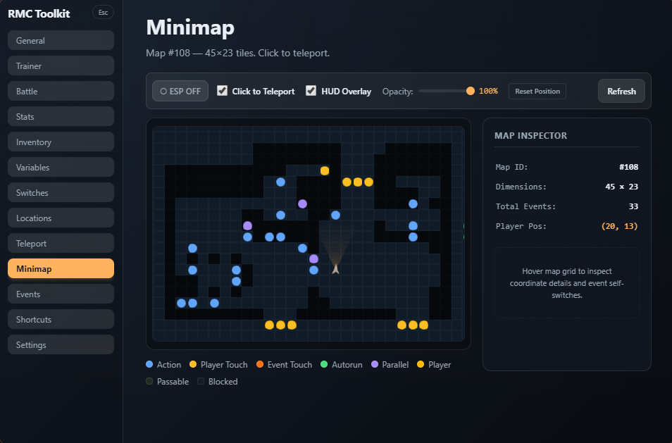
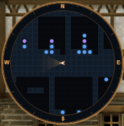

# 🎮 RPG Maker MV/MZ Cheat Toolkit

A modern, high-performance, and feature-rich injectable cheat overlay for RPG Maker MV and MZ games. This toolkit is a complete rewrite in **React 19**, **TypeScript**, and **Tailwind CSS 4**, running directly inside the game's NW.js runtime to read and mutate live game states (`$game*` globals).

## Overview

This project is a modernized, from-scratch rewrite based on the logic and features of the legacy plugins:
- 🔗 [RPG-Maker-MV-MZ-Cheat-UI-Plugin](https://github.com/paramonos/RPG-Maker-MV-MZ-Cheat-UI-Plugin) by **paramonos**
- 🔗 [RPG-Maker-MV-Cheat-Menu-Plugin](https://github.com/emerladCoder/RPG-Maker-MV-Cheat-Menu-Plugin) by **emerladCoder**

### Key Enhancements in this Rewrite:
- **Modern Tech Stack:** Built using **React 19**, **TypeScript**, and **Tailwind CSS 4** for a clean, modular, and typed codebase.
- **Shadow DOM Isolation:** Styles are isolated inside a Shadow DOM container, preventing any CSS leakages or styling conflicts with the host game.

---

## 📸 Showcase

Here is a preview of the modernized cheat toolkit interface running inside RPG Maker MV/MZ games:

### 📁 General Console
<p align="center">
  
</p>

### 🎒 Inventory Modifier
<p align="center">
  
</p>

### 🗺️ Live Minimap & Map Inspector
<p align="center">
  
</p>

### 🧭 HUD Compass Radar
<p align="center">
  
</p>

---

## 📥 How to Install

You can easily install this cheat toolkit into any RPG Maker MV or MZ game using either of the methods below.

---

### Option 1: Automated Installation (Recommended)

This method automatically backs up your game entry file and copies the cheat loader bundle into your game.

#### Step 1: Install Node.js
To run the automated installer script, you need Node.js installed on your computer:
1. Download and install Node.js from the official website: [nodejs.org](https://nodejs.org/) (choose the Recommended/LTS version).

#### Step 2: Get the Cheat Toolkit Files
Download the latest pre-built package:
1. Go to the [Releases](https://github.com/KidiXDev/RPG-Maker-MV-MZ-Cheat-Toolkit/releases) page on GitHub.
2. Download the `rpg-maker-cheat-toolkit-vx.x.x.zip` file under the latest release.
3. Extract the ZIP file to a folder on your computer.

*(Note: If you cloned the source code and want to compile the files yourself, please follow the instructions in the **Developer Guide** section below).*

#### Step 3: Run the Installer
1. Open the project folder.
2. Locate the `scripts` folder:
   - **On Windows:** Double-click `install.bat`. A terminal window will open and ask you to enter the path.
   - **On macOS / Linux:** Open a terminal in the project directory and run:
     ```bash
     node scripts/install.mjs
     ```
3. Copy the path to your target RPG Maker game folder (the folder containing the game executable and files like `package.json` or `www/`) and paste it into the prompt, then press **Enter**.

#### Step 4: Open in the Game
1. Open and play your game.
2. Press **`Ctrl + C`** on your keyboard (or click the floating **RMC** badge in the bottom-right corner of the screen) to open the cheat menu overlay!

---

### Option 2: Manual Installation

If you prefer not to install Node.js or want to perform the steps manually, follow these instructions:

#### Step 1: Create the Cheat Directory
1. Get the cheat toolkit files by downloading and extracting the release ZIP file.
2. Open your target RPG Maker game folder.
3. Locate the game assets directory:
   - **RPG Maker MV:** Open the `www` folder inside the game directory.
   - **RPG Maker MZ:** The assets are in the root game directory itself.
4. Inside that folder, create a new folder named `cheat`.
5. Copy `cheat.js` (from the release's `dist/` directory) and paste it into the newly created `cheat` folder.

#### Step 2: Inject the Loader Code
1. Locate the main JavaScript file of the game:
   - **RPG Maker MV:** Open `<GameDir>/www/js/main.js` in a text editor.
   - **RPG Maker MZ:** Open `<GameDir>/js/main.js` in a text editor.
2. Open the file and insert the following code block at the very top (first line, before any existing game scripts):
   ```javascript
   /* === RMC-CHEAT-TOOLKIT:START (do not edit) === */
   (function(){var s=document.createElement('script');s.src='cheat/cheat.js';
   s.async=false;document.head.appendChild(s);})();
   /* === RMC-CHEAT-TOOLKIT:END === */
   ```
3. Save and close the file.

#### Step 3: Open in the Game
1. Launch the game executable.
2. Press **`Ctrl + C`** or click the floating **RMC** badge in the bottom-right corner to open the cheat menu!

---

## 🛠️ Features

The toolkit provides a comprehensive suite of panels to inspect and modify game states:

| Panel | Description |
| :--- | :--- |
| **📁 General** | Manage core variables (Gold, Steps, Saves, Speed hack, No Clip, God Mode). |
| **⚔️ Trainer** | Manage party members, level, EXP, HP, MP, TP, and buff states. |
| **💥 Battle** | Modify battle states, escape battles, kill enemies, or instant win. |
| **📈 Stats** | View and edit individual character base stats, parameters, and traits. |
| **🎒 Inventory** | Add, remove, or modify quantities of Items, Weapons, and Armor. |
| **🗺️ Minimap** | Interactive 60 FPS minimap displaying passable grids, event placement (with color coding), cursor inspection sidebar, and click to teleport or navigate. |
| **🧭 HUD Overlay** | Draggable circular minimap overlay with a cardinal direction compass bezel, degree indicators, and settings to teleport or walk via pathfinding. |
| **👁️ ESP Overlay** | Direct screen overlay showing game event IDs, names, positions, and interactive trigger zones in real-time. |
| **🔧 Variables** | Search, inspect, and change live RPG Maker game variables. |
| **🔌 Switches** | Search, inspect, and toggle live RPG Maker game switches. |
| **📍 Locations** | Teleport to different coordinates, maps, or specific locations. |
| **🌀 Teleport** | Save custom teleport coordinates and warp directly to them. |
| **🎬 Events** | Trigger, run, or reset map events dynamically. |
| **⌨️ Shortcuts** | Configure hotkeys for quick actions (e.g., healing, toggling no-clip, spawning items). |
| **⚙️ Settings** | Customize the overlay appearance, badge visibility, and UI scaling. |

---

## 🗑️ Uninstalling

If you want to safely remove the toolkit and restore the game to its original state, choose one of the options below.

---

### Option 1: Automated Uninstall

1. Locate the `scripts` folder:
   - **On Windows:** Double-click `uninstall.bat`.
   - **On macOS / Linux:** Open a terminal in the project directory and run:
     ```bash
     node scripts/uninstall.mjs
     ```
2. Paste your game path and press **Enter**. This restores your game's original `main.js` from the automatic backup created during installation.

---

### Option 2: Manual Uninstall

If you installed the toolkit manually or want to clean it up yourself:

#### Step 1: Remove the Injected Loader Code
1. Open the game's JavaScript file in a text editor:
   - **RPG Maker MV:** Open `<GameDir>/www/js/main.js`
   - **RPG Maker MZ:** Open `<GameDir>/js/main.js`
2. Select and delete the code loader block at the very top of the file:
   ```javascript
   /* === RMC-CHEAT-TOOLKIT:START (do not edit) === */
   (function(){var s=document.createElement('script');s.src='cheat/cheat.js';
   s.async=false;document.head.appendChild(s);})();
   /* === RMC-CHEAT-TOOLKIT:END === */
   ```
3. Save and close the file.

#### Step 2: Delete the Cheat Folders
1. Navigate to the game assets directory:
   - **RPG Maker MV:** Open the `www` folder.
   - **RPG Maker MZ:** Open the root game folder.
2. Locate and delete the `cheat` folder.
3. Optionally delete the `cheat-settings` folder to remove any saved cheat tool configuration.

---

## 🚀 Developer Guide (Source Code & Building)

If you are setting up the development environment or building the toolkit from source code:

### Prerequisites
- [Bun](https://bun.sh/) (recommended) or **Node.js 20+**
- A target RPG Maker MV or MZ game running on the NW.js runtime

### Development Setup
To run the browser-based test harness (with mocked RPG Maker global variables for UI design and development):

```bash
# Install dependencies
bun install
```
*Note: Press `Ctrl+C` or click the floating `RMC` badge in the browser to toggle the cheat overlay.*

### Building the Injectable Bundle
Compile the TypeScript and React code into a single client-side script:

```bash
bun run build:inject
```
This generates the standalone bundle:
- `dist/cheat.js` — Self-contained, single-file IIFE bundling React, ReactDOM, toolkit logic, and Tailwind CSS 4 styles (injected inline into the Shadow DOM overlay).

### Alternative Installation via Command Line
For advanced users who prefer specifying target directories via command line flags:

```bash
# Install using Bun
bun scripts/install.mjs --game "C:\path\to\Game"

# Install using NPM
npm run install:game -- --game "C:\path\to\Game"

# Uninstall using Bun
bun scripts/uninstall.mjs --game "C:\path\to\Game"
```

---

## 🛠️ Advanced Usage & Diagnostics

### Diagnostic Logging
If the cheat overlay is not opening or you want to debug runtime errors in the game engine:

```bash
bun scripts/install.mjs --game "C:\path\to\Game" --diagnostic
```
This writes `rmc-diagnostic.log` beside the installed cheat bundle:
- **MV:** `www/cheat/rmc-diagnostic.log`
- **MZ:** `cheat/rmc-diagnostic.log`

The log records bundle startup, game-ready wait completion, overlay mount state, global runtime errors, and shortcut key matches. Reinstall without `--diagnostic` to disable logging.

---

## 🔍 Troubleshooting

- **Overlay won't open in game:**
  - Verify that `Ctrl+C` is the correct key and that you successfully ran `bun run build:inject` before installation (if building from source).
  - Check the Developer Tools console (`F8`, `F12`, or `Ctrl+Shift+I` depending on the game configuration) for initialization errors.
- **Older NW.js runtimes:**
  - If a game uses an older NW.js version, modern JS features might not be supported. Try updating the NW.js runtime of the game or check developer logs.
- **Resetting Settings:**
  - **In Browser Dev:** Clear Local Storage keys prefixed with `rmc-cheat-`.
  - **In Game:** Delete the `cheat-settings/` directory created in your game's runtime folder.
